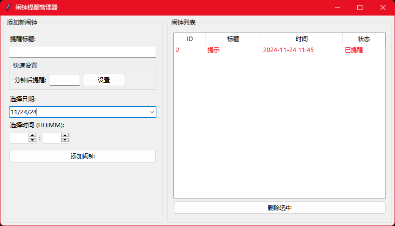

# ⏰ 贴心闹钟助手

> 您的私人时间管理专家，让每个提醒都准时送达！

一个界面清新、操作简单的桌面提醒软件，帮您轻松管理日程，不错过每个重要时刻。

## 💫 界面预览

    
    
<i>简洁清爽的操作界面，轻松管理您的时间</i>

## ✨ 特色功能

🎯 **精准提醒**
- 支持精确到分钟的定时提醒
- 可设置标题和备注，清晰明了
- 贴心提示音，温柔唤醒

⚡ **快捷设置**
- 一键设置几分钟后提醒
- 日历可视化选择时间
- 拖拽调整时间更便捷

🎨 **状态一目了然**
- 绿色：静待提醒的小助手
- 红色：已完成使命的提醒
- 灰色：悄悄溜走的时光

🔄 **智能运行**
- 开机自启，永不缺席
- 隐藏到托盘，界面整洁
- 数据自动保存，安全可靠

## 🚀 开始使用

### 📥 下载安装
1. 下载最新版闹钟助手 (AlarmManager.exe)
2. 双击运行，开启您的时间管理之旅

### 📝 设置提醒

#### 方式一：标准设置
1. 为您的提醒取个好听的名字
2. 在日历上选择期待的日期
3. 调整到想要的时间点
4. 点击"添加闹钟"，搞定！

#### 方式二：快速提醒
1. 输入提醒事项
2. 设置几分钟后提醒
3. 一键搞定，简单快捷！

### 🔍 管理提醒
- 右侧列表清晰展示所有提醒
- 彩色状态标记，一目了然
- 随时查看、轻松删除

### 🎯 系统托盘
右键点击托盘图标，解锁更多功能：
- 📱 显示主窗口
- ⚙️ 设置开机启动
- 🚪 优雅退出

## 📌 温馨提示

- 💡 程序会默默守候在后台，准时送上提醒
- 🎵 温柔的提示音会在适当时候响起
- ⏰ 珍惜当下，不能设置过去的时间哦
- 💾 您的所有提醒都会被安全保存

---

> 让时间更有序，让生活更轻松 ✨
